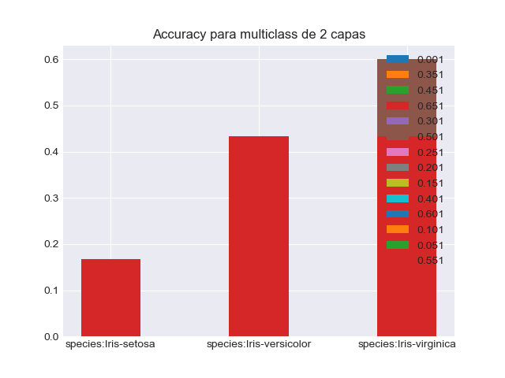

# Daniel Pinto 15-11139, Pedro Rodriguez 15-11264

## Detalles de la implementacion.

Nuestra implementacion hace distincion entre 3 tipos de capas:

- Capas de activacion: Estas son capas ocultas que unicamente aplican una funcion de activacion al input que se les pase. No poseen estado (peso o bias)
- Capas lineales: Estas capas son capas ocultas que guardan como estado una matriz de pesos y de bias para ajustarse, y su output no aplica funciones de activacion.
- Capa de salida de activacion: La capa de salida de activacion es una capa de activacion, pero con la salvedad de que tiene una funcion de costos, y adicionalemente el gradiente de bajada ya en terminos de la funcion de error + la funcion de activacion. Esto nos salva una regla de la cadena.

La razon por la cual hacemos estas 3 distinciones, es para tener un backward propagation mas organico: la forma que se calcula el gradiente de bajada en cada iteracion, es simplemente llamando a un metodo polimorfo. Cosa que no pasaria si juntaramos capas de activacion con capas lineales. Puesto que tendriamos que o encontrar una expresion cerrada para esa combinacion, o tendriamos que hacer el paso de activacion explicito:

```python
# configuracion actual: 3 tipos de capas
for layer in reversed(hidden_layers):
  Y = activations.pop()
  downstream_grad = layer.X_grad(Y=Y,upstream_grad=upstream_grad)
  X = activations[-1]
  W_grads.append(layer.W_grad(X=X,upstream_grad=upstream_grad))
  upstream_grad = downstream_grad

# configuracion no tomada: 2 tipos de capas
for layer in reversed(hidden_layers):
  Y = activations.pop()
  # activacion explicita, activacion fija (se puede evitar anadiendo un metodo)
  error_gradient = logistic_derivative(Y) * upstream_grad
  Y = activations.pop() # sigue siendo correcto? Es mas dificil de razonar
  downstream_grad = layer.X_grad(Y=Y,upstream_grad=upstream_grad)
  X = activations[-1] # sigue siendo correcto? Es mas dificil de razonar
  W_grads.append(layer.W_grad(X=X,upstream_grad=error_gradient))
  upstream_grad = downstream_grad
```

Adicionalmente, proveemos dos clases de activacion para la capa de salida:

- Logistica con log-loss para clasificadores binarios:

```python
class LogisticOutput(OutputLayer):
  def get_output(self,X):
    return 1 / (1 + np.exp(-X))

  def X_grad(self, Y,T, upstream_grad = None):
    return (Y - T) / Y.shape[0]

  def get_cost(self,Y ,T):
    # 1e-7 para evitar log(0)
    return - (Y * np.log(T + 1e-7) + (1-Y)*np.log(1-T + 1e-7)).sum() / Y.shape[0]
```

- Softmax con cross entropy para clasificadores multiclase:

```python
def softmax(X):
  # Softmax es prone a under/overflow
  # pero tiene la propiedad de que:
  # softmax(x) = softmax(x-C) para una C constante
  # entonces podemos normalizar el rango para evitar estos problemas.
  z = X - np.max(X,axis=-1,keepdims=True)
  return np.exp(z) / np.sum(np.exp(z), axis=1, keepdims=True)


class SoftMaxOutput(OutputLayer):
  def get_output(self,X):
    return softmax(X)

  def X_grad(self, Y,T, upstream_grad = None):
    return (Y - T) / Y.shape[0]

  def get_cost(self,Y ,T):
    return - (T * np.log(Y)).sum() / Y.shape[0]
```

El profesor atento notara que ninguna de estas dos capas de salida usan perdida cuadratica. Esto es debido a que el MSE es una funcion no convexa en el caso de componerse con la funcion logistica, lo cual hace que la funcion se pueda quedar atascada en algun minimo local muy por encima del minimo global. Lo cual se pudiera mitigar entrenando la red varias veces con distintos pesos iniciales (haciendo mas larga y tardia la implementacion). Pero adicionalmente, requiere mas iteraciones para encontrar convergencia, puesto que la penalidad de MSE para missclassifications, es menor a la de log-loss. Veamos un ejemplo en donde el modelo predice un output: $1$, cuando el verdadero valor es $0.1$

$$
\begin{align*}
  (Predicted - Target)^2 &=  (1-0.1)^2 = 0.81 \\
  -(Predicted \cdot log(Target)) &= -(1 \cdot log(0.1)) = 2.3
\end{align*}
$$

Teniendo en cuenta que no tomamos la funcion de error, sino el gradiente, y lo utilizamos para multiplicar por regla de la cadena. Esta diferencia de valores se hace mucho mas significativa.

Como ultimo detalle de implementacion, utilizamos minibatches de tamano 25 para la fase de entrenamiento:

```python
def _minibatch(self):
  nb_of_batches = self.X_train.shape[0] // self.batch_size
  return list(zip(
    np.array_split(self.X_train, nb_of_batches, axis=0),
    np.array_split(self.T_train, nb_of_batches, axis=0)))
```

## Clasificador binario: IRIS


Para los clasificadores binarios se siguio la regla de 80/20, sin prestar mucha atencion a otros detalles como lo son el balance de clases al hacer la separacion. Esto porque el split se hace de manera aleatoria para evitar cualquier sezgo que se pueda introducir al particionarlos a mano.


El threshold utilizado fue de $80%$, es decir que cualquier cualquier respuesta mayor a $0.8$ se considera que pertenece a la categoria.

## Clasificador binario: Sin capas ocultas

<p align="center">
  
   <figcaption>Error por iteracion para el clasificador binario: SETOSA</figcaption>
</p>

<p align="center">
  
   <figcaption>Error por iteracion para el clasificador binario: Versicolor</figcaption>
</p>

<p align="center">
  
   <figcaption>Error por iteracion para el clasificador binario: Virginica</figcaption>
</p>

Al plotear las curvas de aprendizaje, vemos un comportamiento asintoticamente similar para cada clasificador. Los datos de estos resultados se pueden encontrar en los archivos `./results/sc_[setosa|versicolor|virginica].csv` en donde se muestran los resultados agrupados por learning rate. 

En particular, observamos que el clasificador para setosa posee un accuracy (definido como $\frac{acertados}{totales}$) perfecto con $100\%$ para cualquier learning rate superior a `1e-3`, el de versicolor logra solo un accuracy de $33.33\%$ para cualquier learning rate superior a `1e-3`, y para virginica un accuracy de $76.66\%$ para cualquier learning rate superior a `2e-1`.

Son estos resultados buenos? Para este problema en particular diriamos que si. Ya que el clasificador mas debil lo podemos descartar y trabajar con los dos clasificadores binarios que poseen un accuracy decente. 

Que el conjunto sea linealmente separable tiene implicaciones en esta topologia? Realmente no para esta topologia. Que el conjunto sea linealmente separable solo significa que no hace falta añadir capas ocultas, lo que hace el proceso de entrenamiento potencialmente menos costoso. Es decir, nos quita una dimension a la hora de resolver el problema. Ahora solo necesitamos variar el learning rate junto al numero de iteraciones.

## Clasificador binario: Una capa oculta


Para este clasificador se utilizo una capa oculta de 5 neuronas, esto debido a que los datos son linealmente separables, y se hipotiza que al proyectarlas en un espacio con mayores dimensiones, esta caracteristica se pronuncie mas.

<p align="center">
  
   <figcaption>Error por iteracion para el clasificador binario con una capa oculta: setosa</figcaption>
</p>

<p align="center">
  
   <figcaption>Error por iteracion para el clasificador binario con una capa oculta: Versicolor</figcaption>
</p>

<p align="center">
  
   <figcaption>Error por iteracion para el clasificador binario con una capa oculta: Virginica</figcaption>
</p>

Los resultados de estas topologias, se encuentran en `results/sc[setosa|versicolor|virginica]_l1.csv`. Igualmente, agrupados por learning rate.

En el csv, encontramos accuracy similares: $100\%$ en setosa para learning rates mayores a $0.5$ y $80\%$ en Versicolor,Virginica, para learning rates mayores a $0.1$. Lo cual es una mejora estricta sobre nuestro anterior clasificador. Pero es una mejora real? 

Un $7\%$ de mejora es algo significativo, sin embargo, hay que notar que aunque el clasificador de Versicolor mejoro su accuracy en $40\%$, hubieramos tenido el mismo resultado si simplemente hubieramos corrido los otros dos clasificadores y luego haciendo descarte.

Es esta topologia suficientemente buena? Si! $80\%$ de precision es un buen resultado. 

## Clasificador binario: Dos capas ocultas

Finalmente para el clasificador binario de dos capas, utilizamos 5 neuronas en cada una de las capas. Tratando de mantener la dimensionalidad mayor a la del problema original, sin necesidad de irnos a espacios mas grandes.

<p align="center">
  
   <figcaption>Error por iteracion para el clasificador binario con dos capas ocultas: Setosa</figcaption>
</p>

<p align="center">
  
   <figcaption>Error por iteracion para el clasificador binario con dos capas ocultas: Versicolor</figcaption>
</p>

<p align="center">
  
   <figcaption>Error por iteracion para el clasificador binario con dos capas ocultas: Virginica</figcaption>
</p>


Los resultados de estas topologias, se encuentran en `results/sc[setosa|versicolor|virginica]_l2.csv`. Igualmente, agrupados por learning rate.

Y para sorpresa de absolutamente nadie. Esta red converge con los mismos resultados que la de una capa. Esto es debido a que el conjunto de funciones que puede aproximar una red de dos capas, contiene al conjunto de funciones que puede aproximar una red de una sola. Y dado que los datos son linealmente separables, y por ende, pertenecen al conjunto de funciones que puede aproximar una red de una capa. Deberiamos tener resultados similares.

## Finalmente... Sobre clasificadores binarios

Argumentamos que como el conjunto es linealmente separable, entonces podemos realizar descarte. Sin embargo la verdadera pregunta era si nuestros resultados corroboran esto. Y la triste verdad es que... Si! Que la red de 0 capas ocultas tenga un accuracy bajo solo para la ultima clase es indiferente, puesto que de igual forma trabajamos sobre un universo cerrado!

## Clasificador multiclase

El clasificador multiclase, a diferencia del clasificador binario, hace uso de la funcion softmax en la capa de salida, usando cross entropy como funcion de error. En teoria, tenemos un par de condiciones extremadamente deseables para poder utilizar softmax: cada punto solo puede tener una unica clasificacion y un  conjunto linealmente separable. Sin embargo, como veremos a continuacion,  los resultados obtenidos terminan siendo subpar.

Los archivos para ambos clasificadores se encuentran en `./results/mc_1c.csv` y en  `./results/mc_2c.csv`

## Clasificador multiclase: Con una capa oculta

El clasificador con una sola capa oculta, de 4 neuronas, solo logra un accuracy de $35\%$ en el mejor de las clases,  fracasando en todas las predicciones del conjunto de setosa.

<p align="center">
  
   <figcaption>Accuracy para el clasificador multiclase con una capa oculta</figcaption>
</p>

<p align="center">
  
   <figcaption>Error por iteracion para el clasificador multiclase con una capa oculta</figcaption>
</p>

## Clasificador multiclase: Con dos capas ocultas

Aunque este clasificador de 4,5 neuronas, plantea una mejora sobre el anterior, aun los resultados poseen un accuracy bajo, .

<p align="center">
  
   <figcaption>Accuracy para el clasificador multiclase con una capa oculta</figcaption>
</p>

<p align="center">
  
   <figcaption>Error por iteracion para el clasificador multiclase con dos capas ocultas</figcaption>
</p>


## Clasificador multiclase: Con una capa oculta: Logistic

Y aunque cambiemos nuestro clasificador de una capa con 5 neuronas, a que use como funcion de salida, la funcion logistica. Obtenemos resultados aun mas bajos que los usados con la funcion softmax.

<p align="center">
  
   <figcaption>Accuracy para el clasificador multiclase con una capa oculta</figcaption>
</p>

<p align="center">
  
   <figcaption>Error por iteracion para el clasificador multiclase con dos capas ocultas</figcaption>
</p>

## Por que tan salado?

Realmente, no es culpa de la funcion de activacion usada en la capa de salida, puesto que impuso una mejora sobre la funcion logistica. Tampoco es problema de la topologia ni de los hiperparametros puesto que son los mismos o similares a la de los clasificadores binarios. Entonces, donde esta el problema?

Lo ultimo que queda por inspeccionar es overfitting, o falta de datos. Nosotros nos inclinamos por lo 2do. Los clasificadores multiclase necesitan alimentarse de mas informacion, puesto  que este trata de comparar caracteristicas mas complejas (interacciones entre las clases?) que los clasificadores binarios. Y el cuerpo con el que trabajamos, es bastante pequeno, tan solo 150 muestras.


## Clasificador de spam.