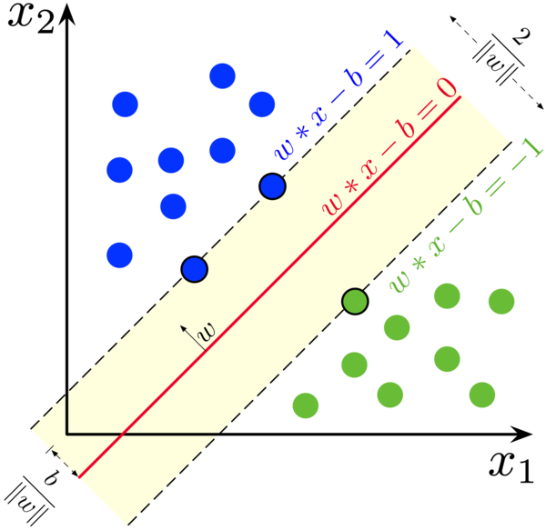

# Daniel Pinto 15-11139, Pedro Rodriguez 15-11264

## Pregunta 0

_Una manera en la que se suele introducir no linealidad en los métodos de aprendizaje, es a través de la función de base radial:_

$k(X,X') = exp\left(-\dfrac{\Vert X - X' \Vert^2}{2\sigma^2} \right)$


_Con $\sigma$ alguna constante seleccionada. Demuestre que esta función es un kernel._
Primero reescribamos de otra forma $\Vert X - X' \Vert^2$:


\begin{align*}
  & \Vert X - X' \Vert^2 \\
  \equiv \quad & \sqrt{\sum (x_i - x'_i)^2}^2 \\
  \equiv \quad & \sum x_i^2 - 2 x_i x'_i+ {x'}_i^2 \\
  \equiv \quad & \sum x_i^2 - 2\sum x_i x'_i + \sum {x'}_i^2  \\
  \equiv \quad & \Vert X \Vert^2 -2 X^T X' + \Vert X' \Vert
\end{align*}


Donde $0 \leq i \leq n$ siendo $n$ el número de componentes de los vectores $X$ y $X'$

Reescribamos $k(X,X') = exp\left(-\dfrac{\Vert X - X' \Vert^2}{2\sigma^2} \right)$: 


\begin{align*}
  & k(X,X') = exp\left(-\dfrac{(\Vert X - X' \Vert)^2}{2\sigma^2} \right) \\
  & k(X,X') = exp\left(-\dfrac{(\Vert X \Vert)^2 -2 X^T X' + (\Vert X' \Vert)}{2\sigma^2} \right) \\
  & k(X,X') = exp\left(-\dfrac{(\Vert X \Vert)^2}{2\sigma^2} \right) exp\left(\dfrac{X^T X'}{\sigma^2} \right) exp\left(-\dfrac{(\Vert X' \Vert)^2}{2\sigma^2} \right)
\end{align*}


Por definición de Kernel $k'(X,X')=X^T X'$ es un Kernel con la funcion $\phi(X)=X$, y dado a que $\sigma^2$ siempre es una constante positiva, por propiedades de Kernel entonces $k'(X,X')=\dfrac{X^T X'}{\sigma^2}$ es un Kernel, y $k''(X,X')=exp\left(\dfrac{X^T X'}{\sigma^2}\right)$ también es un Kernel por propiedades de Kernel.

Adicionalmente definimos la función $f(X) = exp\left(-\dfrac{\Vert X \Vert^2}{2\sigma^2} \right)$ tal que esta es una función real por definición de $exp$.

Sabiendo todo esto reescribimos $k(X,X')$ como:


\begin{align*}
  & k(X,X') = exp\left(-\dfrac{(\Vert X \Vert)^2}{2\sigma^2} \right) exp\left(\dfrac{X^T X'}{\sigma^2} \right) exp\left(-\dfrac{(\Vert X' \Vert)^2}{2\sigma^2} \right) \\
  \equiv \quad & k(X,X') = f(X) k''(X,X') f(X')
\end{align*}


Donde al ser $k''(X,X')$ un Kernel, y $f(X)$ una función real, por propiedades de los Kernels concluimos que $k(X,X')$ también es un Kernel.


## Pregunta 1

_Al utilizar un conjunto de datos como base para el entrenamiento, es posible encontrar de alguna manera u otra la presencia de ruido. Esto puede venir dado por la presencia de valores atípicos, por información incorrecta, o simplemente por la aparición de ruido aleatorio._

_Contrario a lo que se pudiera pensar, un hiperplano óptimo (de máximo margen), es un método de clasificación
robusto ante el ruido en los datos de entrenamiento._


Consideremos el siguiente diagrama:




En el observamos que para que una perturbacion $x+\epsilon$ miss-clasifique a $x$, la perturbacion debe tener magnitud $\epsilon > \dfrac{1}{||w||}$ (en direccion $\vec{w}$).

Adicionalmente, sabemos que $||w||^2 = \sum \alpha_i$ en donde los $\alpha_i$ son los multiplicadores de lagrange. 

El truco es que $\alpha_i = 0$ para todos aquellos vectores que **no son vectores de soporte**. Y como podemos ver en la imagen, para un conjunto linealmente separable, la cantidad de vectores de soporte suele ser baja. Lo que directamente implica que $||w|| = ||\alpha|| = \sqrt{\sum \alpha}$ es un valor pequeno, y $\dfrac{1}{||w||}$ es un valor grande, mayor a cualquier $\epsilon$ considerado ruido.

Sin embargo, si nuestra data **no es** linealmente separable. Necesitamos indicar un "threshold" (comunmente conocida en optimizacion como variable de slack), que incluya mas vectores de soporte entre los hiperplanos. Lo cual hace que la abstraccion deje de comportarse de manera robusta si el slack es muy amplio.

## Pregunta 2

_Seleccione alguna librería de SVM existente, con buenos resultados en benchmarks de eficiencia. Se recomienda que use librerías en su lenguaje de preferencia basadas en LibSVM. Otra opción recomendada es usar LaSVM, el cuál incluye programas para realizar experimentos, dado que se produzca un archivo en
un formato común, para el cuál existen librerías en múltiples lenguajes._

_Utilice el conjunto de datos iris, utilizado en el Proyecto 2 para entrenar únicamente clasificadores binarios._

_Justifique apropiadamente el uso de Kernels, si decide usarlo. Compare sus resultados con aquéllos obtenidos usando redes neuronales, e incluya como parte de esta respuesta únicamente los datos necesarios para sustentar
esta comparación._

Para esta tarea, utilizamos el objeto `svm` de `scikit-learn` para realizar las predicciones (la cual esta basada en `LibSVM`). Cuya interzas hace entrenar el clasificador totalmente trivial:

```python
def cont(train,train_t,test,test_t,targets,learning_rate=None):
  
  clf = svm.SVC()
  clf.fit(train, np.ravel(train_t))
  predictions = clf.predict(test)
  delta = predictions - np.ravel(test_t)
  df = pd.DataFrame(delta, columns=targets)

  return resultados(df,targets,learning_rate,output="")


def cont_linear(train,train_t,test,test_t,targets,learning_rate=None):
  
  clf = svm.SVC(Kernel="linear")
  clf.fit(train, np.ravel(train_t))
  predictions = clf.predict(test)
  delta = predictions - np.ravel(test_t)
  df = pd.DataFrame(delta, columns=targets)

  return resultados(df,targets,learning_rate,output="")
```

Para nuestras pruebas, utilizamos dos Kernels, el trivial `linear`, y el `RBF`. La razon por la cual probamos `RBF` era simplemente para compararlo con el Kernel linear: si ambos dan el mismo resultado, esto confirma que nuestro conjunto de datos es linealmente separable.

Y aunque los resultados se pueden ver en `results/svn_XYZ.csv`, la mejora del accuracy es significativa: un $10\%$ de mejora para `versicolor` y un $40\%$ para `virginica`, sin mencionar que es ordenes de magnitud mas rapido.

Los resultados del `SVM` linear confirman que tenemos un conjunto linealmente separable. Mas aun, quizas una razon por la cual `SVM` obtiene mejores resultados que nuestra `NN`, es porque requiere de considerablemente menos training data para encontrar el boundary.

Debido a que `src.svn.py` utiliza gran parte de la maquinaria del proyecto 2 (para leer datos y guardar resultados). Anexamos el proyecto 2 con este archivo y un main `svn.py` que genere los resultados.
